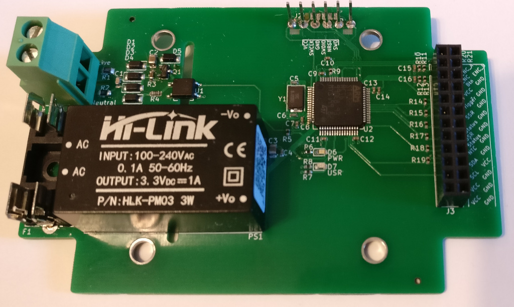

# ZCSSR - Zero crossing solid state relay controller

A PCB and software for a SSR controller that monitors mains AC zero crossings to determine when to turn the SSR on.

[more images](docs/img/README.md)

## Why

I wanted to build a spot welder from an old MOT (microwave oven transformer) but wasn't satisfied with simply enabling the SSR at random because this makes the pulse +/- 1 half mains cycle (10ms on 50Hz, 8.3ms on 60Hz). It probably doesn't make much difference in the grand scheme of things but I wanted to know exactly how long the pulses were. 

This controller solves that issue by monitoring the mains zero crossing and triggering the SSR just before a zero crossing - the SSR has it's own zero crossing circuit to actually turn on it's output so as long as the controller doesn't fire more than 1 cycle early it will work as expected.

I also wanted to completely finish an embedded project written in rust and this project seemed about the right size undertaking.

## Uses

* Spot welder
* Reflow oven
* Sous vide
* Smoker
* Probably other things that need temp input (K-Type thermocouple) and switched mains ouput

## Features

* Zero crossing detection circuit
  * Pulse at least 0.4ms before the zero crossing
  * Isolated
  * 100-240V, 50/60Hz
  * [Details](docs/SimpleIsolatedZeroCrossDetector.pdf)
* UI
  * Quadrature encoder with push button 
  * LED for general status
  * LED for SSR status
  * 4 digit 14-segment LCD display. I2C
  * Trigger input 
* Temperature monitoring
  * NTC thermister for monitoring SSR/Transformer temperature
  * K-Type thermocouple input. MAX31855
* STM32F1 64-pin LQFP MCU. Specifically STM32F103RCT but any should work
* SWD (serial wire debug) programming & debugging
* USB hardware. In theory USB programming will be possible but not yet implemented

## Tools used

Not a complete list. Will add to it as features get implemented

* [Kicad](http://www.kicad-pcb.org/)
* [Rust](http://www.rust-lang.org/)
  * [cortex-m](http://github.com/rust-embedded/cortex-m) and [cortex-m-rt](http://github.com/rust-embedded/cortex-m-rt)
  * [cortex-m-rtfm RTOS](http://github.com/rtfm-rs/cortex-m-rtfm)
  * [stm32-rs peripheral register definitions](http://github.com/stm32-rs/stm32-rs)
  * [stm32f1xx-hal HAL implementation](http://github.com/stm32-rs/stm32f1xx-hal)
  * [adafruit-alphanum4.rs driver for Adafruit 14-segment LED Alphanumeric Backpack](http://github.com/cs2dsb/adafruit-alphanum4.rs)
    * [ht16k33 LED driver](http://github.com/jasonpeacock/ht16k33)

## License

This template is licensed under either of

- Apache License, Version 2.0 ([LICENSE-APACHE](LICENSE-APACHE) or
  http://www.apache.org/licenses/LICENSE-2.0)

- MIT license ([LICENSE-MIT](LICENSE-MIT) or http://opensource.org/licenses/MIT)

at your option.