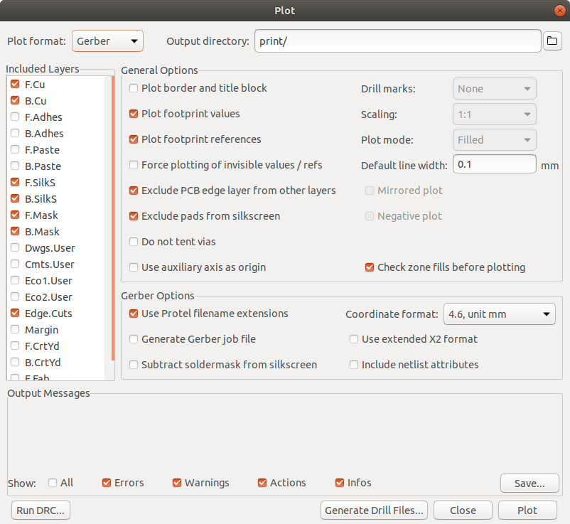
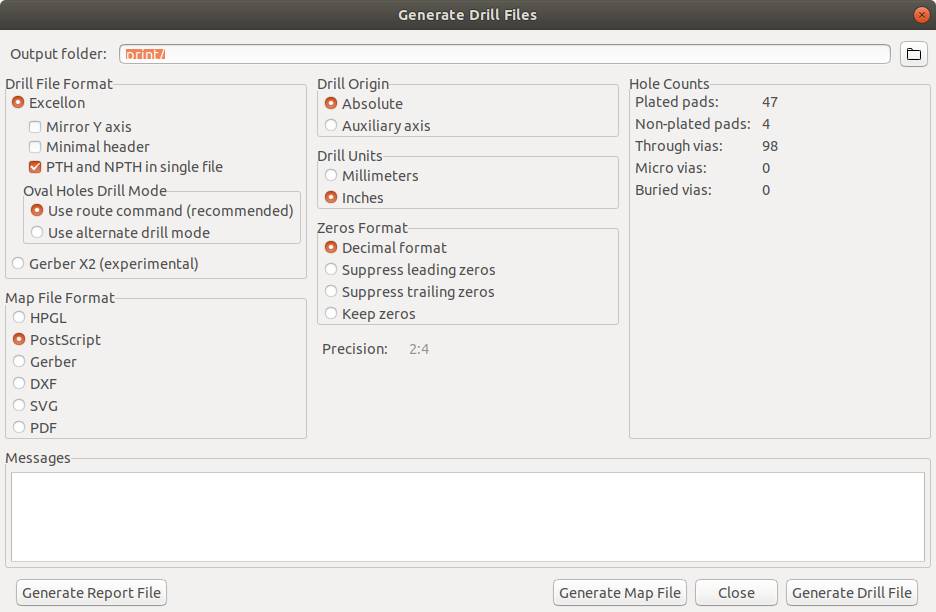
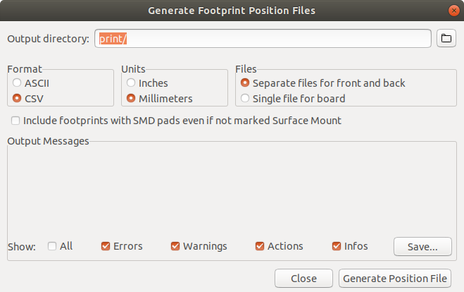

# Generating gerbers and fab outputs

## Bill of materials
1. Open the schematic 
2. Click the BOM button: 
3. Select `bom2grouped_csv`
4. Press `Generate`
5. Navigate to the project folder in the terminal
6. Move "zero_crossing_detector" (note no extension) to "print/zero_crossing_detector-bom.csv"
    * `mv zero_crossing_detector print/zero_crossing_detector-bom.csv`
7. Close the schematic

## Gerbers
1. Open the kicad_pcb
2. Press `b` to refill zones
3. Click the Plot button: 
4. Check the options are correct
    
5. Press `Plot`
6. Press `Generate Drill Files...`
7. Check the drill options are correct
    
8. Press `Generate Drill File`
9. Close the drill window
10. Close the plot window

## Footprint position file
1. Still in kicad_pcb
2. Click File | Fabrication Outputs | Footprint Position (.pos) File...
3. Check the pos options are correct
    
4. Press `Generate Position File`

## Post processing the files
1. Go to the project folder in the terminal
2. Go to the print folder
3. Run `rename_gbrs.sh` which will
    * Delete any old `print.zip`
    * Rename the `PosX` and `PosY` columns in the footprint pos file to `Mid X` and `Mid Y` as required by JLCPCB
    * Make sure the BOM is csv rather than semi-colon separated (probably no longer necessary)
    * Rotate `Q1` to fix alignment on reel
    * Zip everything up in `print.zip`