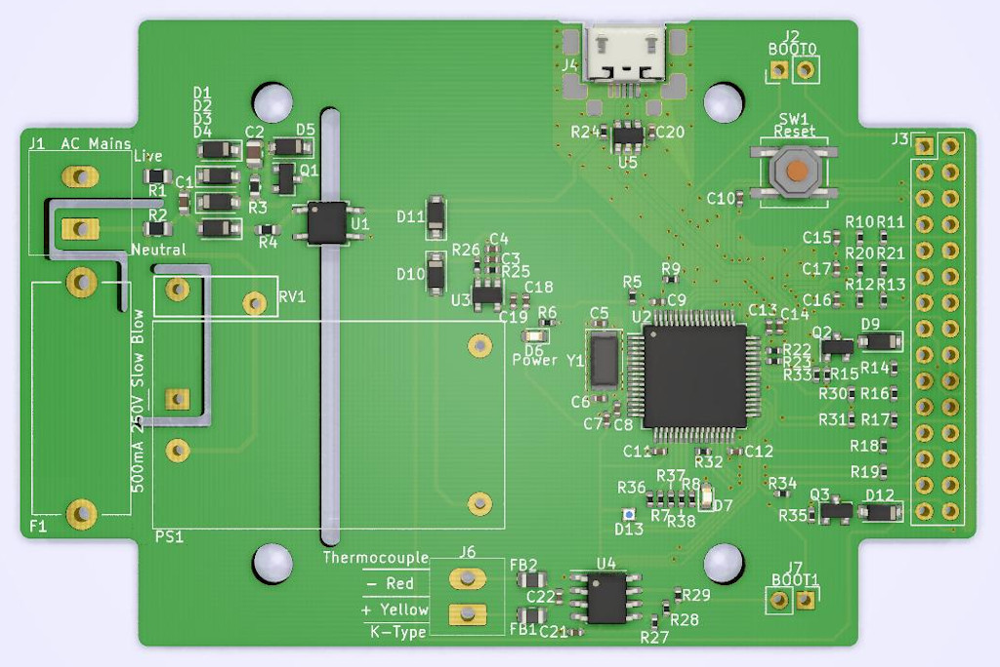

# TH_v0.1

* ATMEGA328P based

# SMD_v0.1

* STM32F1 based 

### Board as it came from JLCPCB assembly service

### Fully assembled with through hole components

# SMD_v0.2

* Added MAX31855
* Added USB 
* Moved connectors closer to edges to free up space in the middle of the enclosure

### Render from kicad
