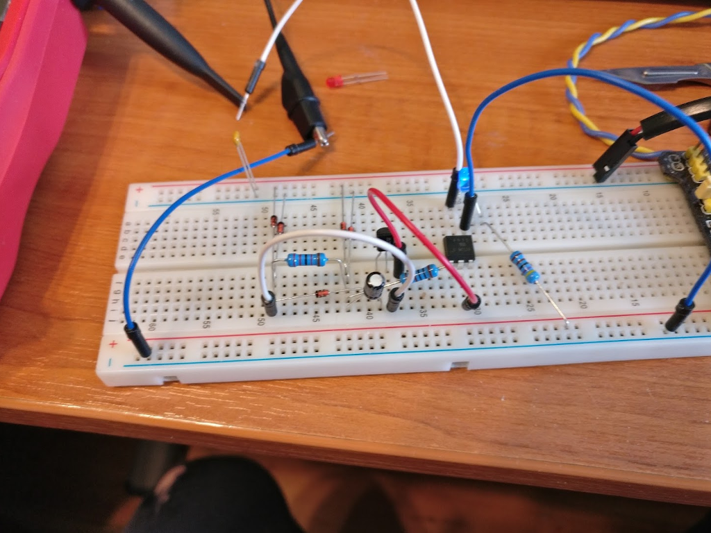
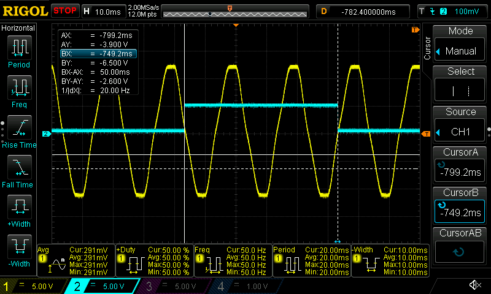
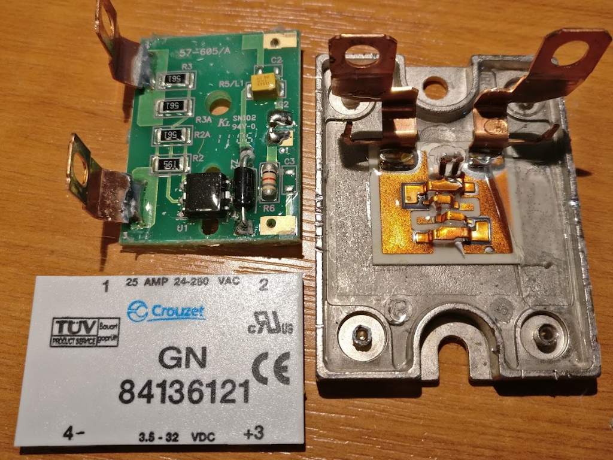
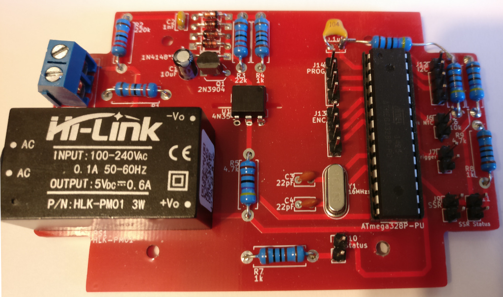
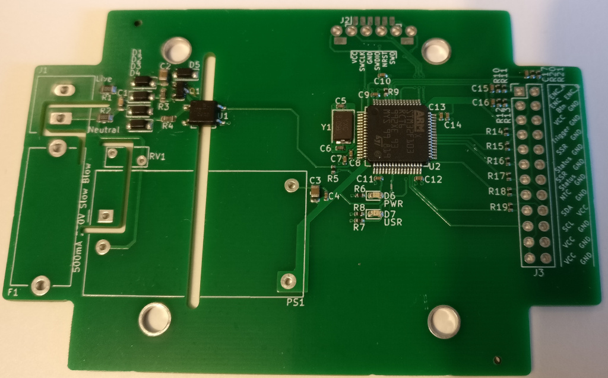

# Project log

## 5-Sept-2019

* Breadboard prototyped zero crossing circuit based on [this circuit](SimpleIsolatedZeroCrossDetector.pdf) (originally from drextel.net but the domain has sadly gone dormant). 
* There are simpler ZC circuits but this one appears to have some additional benefits, works really well and doesn't add much to the BOM cost
* Arduino POC code using hardware timer to detect ZC edges and ISR to record the timer count
    * Works ok, measures the width and time of the pulse with good precision
    * GPIO output on scope looks good against AC waveform 

## 6-Sept-2019

* Received Couzet SSRs
* Tore one down to make sure they are genuine 
* Hooked up SSR output to scope and showed that triggering GPIO in ISR was sufficiently before the ZC to correctly enable the SSR in time for the ZC

## 8-Sept-2019

* Ordered TH_v0.1 boards from JLCPCB

## 25-Sept-2019

* Received TH_v0.1 boards 
* Missing pullup on RST. Working as expected other than that
* 14-Segment Adafruit display working nicely over I2C
* Rotary encoder seems like a reasonable input device for the kind of config this needs (pulse1, delay1, pulse2, delay2)
* NTC working

## 7-Oct-2019

* Ordered SMD_v0.1 boards assembled from JLCPCB
* STM32F1 available for assembly as a basic part
* STM32 has richer set of peripherals than ATMEGA328P
    * Timer can do quadrature encoder input with no software interaction
    * Timer can do PWM input capture to measure the frequency and duty of the ZC signal
    * Timer can be configured in one-shot mode to enable the SSR for a given time and have the hardware turn it off regardless of a crashed program or delayed ISR or something
* STM32 can also be programmed with rust and the F1 has pretty good support

## 22-Oct-2019

* Received SMD_v0.1 boards from JLCPCB 
* Identified issues:
    * Q1 Base and Collector are switched. Resolved with some solder bodging
    * Varistor/Mov leads are too thick for holes. Resolved with some solder bodging
    * Pwr led is annoyingly bright with 150Ω resistor. Had a 680Ω to replace it with but still too bright. Changed to 1k in schematic
    * ZC input on TIM2_CH3 can't be used for PWM input. Fortunately CH1 & CH2 are adjacent so resolved with some solder bodging

## 28-Oct-2019

* Note to self: don't plug the mains in when loose dupont wires are nearby. Destroyed ST-Link and F1 on POC board
* Ordered fuse cover to partially protect mains contacts
* Added longish ribbon with all low voltage outputs and fitted lid of box so nothing can get in by accident

## 3-Nov-2019

* Recieved replacement ST-Link
* Basically all the bits are implemented in rust. Few PRs for stm32f1xx-hal to enable extra timers
* Implemented driver for 14-segment display [adafruit-alphanum4.rs](https://github.com/cs2dsb/adafruit-alphanum4.rs)
    * Added to rust-embedded awesome list which is nice. Hopefully it'll be useful to someone

## 11-Nov-2019

* Did quite a bit of documentation for the repo
* Finished updating SMD_v0.2 PCB ready to order
    * Added MAX31855K K-Type thermocouple interface IC to enable reflow oven use case
    * Added USB port, mainly as an experiment to see if I can get it working and useful (USB DFU mode would be amazing but failing that, something similar to the TS-100 USB functionality would be ok)
    * Added a physical reset button. In theory, SWD doesn't need hardware reset and openocd should be able to connect to the core with just CLK, DIO and GND but in practice I've had boards fairly regularly get into a state where it can't connect reliably. Resetting by shorting NRST to GND resolves this and the board will work without reset until the ST-Link is unplugged or the boards power is cycled. I haven't been able to get to the bottom of it - the core is running, the gpio for SWD hasn't been reconfigured and I've tried every permutation of reset_config in openocd. There's some speculation on some forums that the ST-Link firmware is to blame as it's not a proper JTAG adapter and merely emulates some features; I could buy a proper JTAG adapter to rule this out but I want these boards to be programmable by anyone with a cheap adapter. This programming faff partially fed into the desire to add USB and explore USB bootloading. 

## 13-Nov-2019

* Changed AC-DC module from 3.3V to 5V to allow 5V SSR (or relay) output
* Switched LDO to AP2112 as used on several Adafruit boards. It has better specs and doesn't require tantilum caps to be stable
* 5V in allows using simple diodes to block backfeeding AC-DC or USB 5V inputs
* Added transistors to control SSR and MISC outputs so they can be 5V rather than directly driven from MCU GPIO pins

## 15-Nov-2019

* Added tiny 1x1mm rgb LED to spare pins near the existing LED. Mainly want to see how bright this tiny LED is at ~5ma

## 16-Nov-2019

* Placed an order for the next version of the PCB